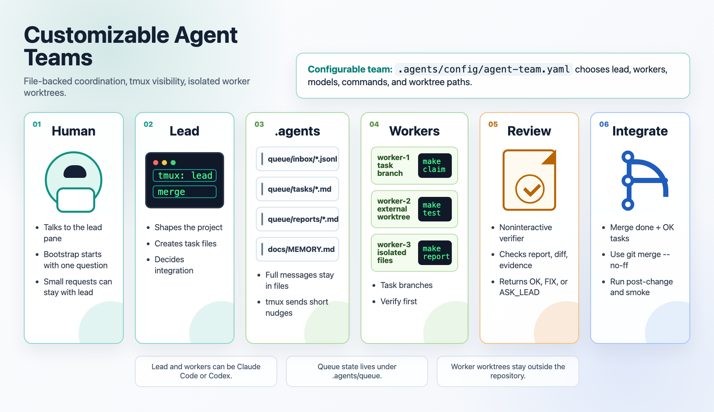

# customizable-agent-teams

Claude Code と Codex を混ぜて、ローカルの tmux 上で lead / worker チームを動かすためのテンプレートです。

このリポジトリを使うと、次の流れをそのまま始められます。

1. lead pane に人間が依頼する。
2. lead が小さい変更は直接行い、大きい変更は task に分ける。
3. worker が repo 外 worktree の task branch で実装する。
4. worker が検証、smoke、review 対応、report 更新まで行う。
5. lead が `make integrate` で root repository に取り込む。



## Quick Start

1. 前提ツールをインストールする。

macOS:

```bash
brew install gh ripgrep fd bat jq yq git-delta direnv tmux pnpm node python uv
brew install --cask codex
npm install -g @anthropic-ai/claude-code
```

Linux:

```bash
npm install -g @openai/codex @anthropic-ai/claude-code
wget -qO- https://get.pnpm.io/install.sh | sh -
wget -qO- https://astral.sh/uv/install.sh | sh

type -p wget >/dev/null || (sudo apt update && sudo apt install -y wget)
sudo mkdir -p -m 755 /etc/apt/keyrings
out=$(mktemp) && wget -nv -O"$out" https://cli.github.com/packages/githubcli-archive-keyring.gpg
cat "$out" | sudo tee /etc/apt/keyrings/githubcli-archive-keyring.gpg > /dev/null
sudo chmod go+r /etc/apt/keyrings/githubcli-archive-keyring.gpg
sudo mkdir -p -m 755 /etc/apt/sources.list.d
echo "deb [arch=$(dpkg --print-architecture) signed-by=/etc/apt/keyrings/githubcli-archive-keyring.gpg] https://cli.github.com/packages stable main" | sudo tee /etc/apt/sources.list.d/github-cli.list > /dev/null
sudo apt update
sudo apt-get install -y gh ripgrep fd-find bat jq direnv tmux python3 nodejs npm
command -v fd >/dev/null || sudo ln -s /usr/bin/fdfind /usr/local/bin/fd
command -v bat >/dev/null || sudo ln -s /usr/bin/batcat /usr/local/bin/bat
```

2. 今の shell で `direnv` を有効にする。

```bash
if [ -n "${ZSH_VERSION:-}" ]; then
  rc="$HOME/.zshrc"
  hook='eval "$(direnv hook zsh)"'
  eval "$(direnv hook zsh)"
elif [ -n "${BASH_VERSION:-}" ]; then
  rc="$HOME/.bashrc"
  hook='eval "$(direnv hook bash)"'
  eval "$(direnv hook bash)"
else
  echo "Add the direnv hook for your shell, then rerun Quick Start." >&2
  exit 1
fi
grep -Fqx "$hook" "$rc" 2>/dev/null || printf '\n%s\n' "$hook" >> "$rc"
```

3. bootstrap を開始する。

```bash
make bootstrap
```

attach すると `lead` pane が bootstrap を開始し、何を作るかを最初の1問として聞きます。

4. lead の質問に答える。

lead の質問に答えると、次のものがプロジェクト用に初期化されます。

- 何を作るか
- 使用言語と package manager
- formatter / linter / test runner
- build command
- `make post-change`
- `make smoke` で確認する代表的な利用者向け動作
- README、AGENTS、package metadata、entrypoints

5. bootstrap を完了して、worker を含めた team を起動する。

bootstrap が終わったら tmux から detach して、repository root の shell で実行します。tmux の detach は `Ctrl-b` の後に `d` です。

```bash
make bootstrap-finish
```

`make bootstrap-finish` が終わると、worker を含む `agent-team` tmux session に attach されます。

## Configure Agents

Lead / Worker / Verifier は `.agents/config/agent-team.yaml` で変更できます。

- `team.lead`: lead agent の CLI、model、tmux window、起動 command
- `team.workers`: worker 数、CLI、model、tmux window、worktree path、起動 command
- `team.review`: verifier の CLI、model、timeout、output directory

Lead / Worker / Verifier は Claude Code / Codex などに差し替えられます。worker worktree path では `{team_root}` が repository directory name に展開されます。

## Start A Team

```bash
make team-start
tmux attach -t agent-team
```

lead への依頼は、tmux の `lead` pane にそのまま入力します。

agent 間の通知は短い `inbox <agent_id>` だけです。本文は `.agents/queue/inbox/` と `.agents/queue/tasks/` にあります。

```bash
make inbox AGENT=worker-1
make inbox AGENT=worker-1 MARK=<message_id>
```

pane に `inbox <agent_id>` が入力されたまま止まっている場合:

```bash
make team-submit AGENT=worker-1
```

## Dispatch A Task

```bash
cp .agents/queue/tasks/TEMPLATE.md .agents/queue/tasks/T-001.md
${EDITOR:-vi} .agents/queue/tasks/T-001.md
make team-send TO=worker-1 TYPE=task_assigned TASK=T-001
make team-status
```

task file では branch を必ずこの形にします。

```text
Owner: worker-1
Branch: task/worker-1/T-001
```

## Worker Commands

```bash
make claim TASK=T-001 AGENT=worker-1
make post-change
make smoke
git add <changed-files>
git commit -m "T-001: implement task"
make report TASK=T-001 AGENT=worker-1 STATUS=needs-review
make review TASK=T-001 AGENT=worker-1
```

review result:

- `OK`: `make report TASK=T-001 AGENT=worker-1 STATUS=done`
- `FIX`: 修正、再検証、追加 commit、再 report、再 review
- `ASK_LEAD`: report に質問を書いて lead に相談

review artifact を読んだ後、review 通知が inbox に残っていれば mark します。

```bash
make inbox AGENT=worker-1
make inbox AGENT=worker-1 MARK=<message_id>
```

## Integrate

lead は `ready-to-integrate` の task だけを取り込みます。

```bash
make team-status
make integrate TASK=T-001 AGENT=worker-1
```

`make integrate` は `--no-ff` merge、`make post-change`、`make smoke` を実行し、結果を `.agents/queue/integrations/` に残します。

## Stop

```bash
make team-stop
```

## Harness Maintenance

agent-team harness 自体を変更したときの確認:

```bash
make post-change
make harness-test
```

Harness tests live in `.agents/tests/harness/`.

## Important Files

- `AGENTS.md`: 全 agent 共通の作業ルール
- `CLAUDE.md`: `AGENTS.md` への symlink
- `.agents/skills/`: Codex / Claude Code 共通 skill
- `.codex/skills`: `.agents/skills` への symlink
- `.claude/skills`: `.codex/skills` への symlink
- `.agents/config/agent-team.yaml`: role、model、起動 command、worktree 設定
- `.agents/docs/TEAM_PROTOCOL.md`: task、report、review、integration の詳細手順
- `.agents/docs/MEMORY.md`: 共有 memory と更新ルール
- `.agents/queue/tasks/`: task files
- `.agents/queue/inbox/`: agent inbox
- `.agents/queue/reports/`: worker reports
- `.agents/queue/reviews/`: verifier reviews
- `.agents/queue/integrations/`: lead integration logs
- `.agents/scripts/`: harness commands
- `.agents/tests/harness/`: harness tests
- `Makefile`: 操作用 entrypoints
